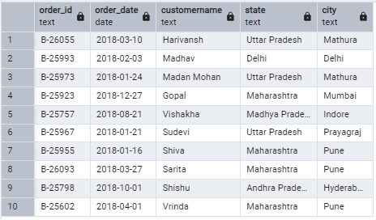
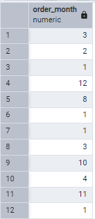
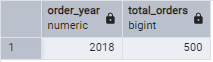
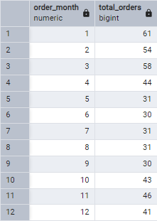
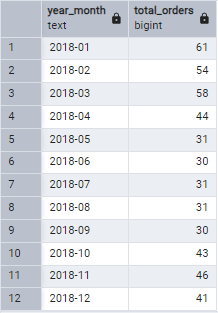
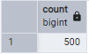
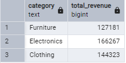
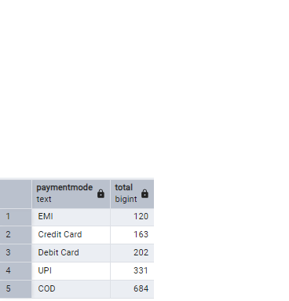
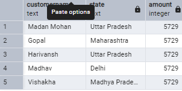
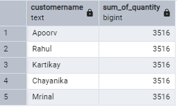

# 🛒 Online Orders – SQL Analysis Project

This project demonstrates SQL-based analysis of an **online retail orders** dataset using **PostgreSQL**. The dataset includes two CSV files: `Orders.csv` and `Details.csv`, both of which are loaded, cleaned, and queried for business insights.

---

## 📂 Dataset Overview

### `Orders.csv`
Contains high-level order information:
- `Order_ID`: Unique identifier for each order
- `Order_Date`: Date of the order (converted to proper date format)
- `CustomerName`: Customer who placed the order
- `State`, `City`: Geographic location of the order

### `Details.csv`
Includes line-level transactional data:
- `Order_ID`: Reference to the order
- `Amount`: Total order value
- `Profit`: Profit from the order
- `Quantity`: Units ordered
- `Category`, `Sub_category`: Product classification
- `PaymentMode`: Payment method used

---

## 🗃️ Table Structures

### `Orders` Table
```sql
CREATE TABLE Orders (
    Order_ID TEXT,
    Order_Date DATE,
    CustomerName TEXT,
    State TEXT,
    City TEXT
);
```

### `Details` Table
```sql
CREATE TABLE Details (
    Order_ID TEXT,
    Amount INTEGER,
    Profit INTEGER,
    Quantity INTEGER,
    Category TEXT,
    Sub_category TEXT,
    PaymentMode TEXT
);
```

---

## 🔄 Data Import Steps

1. Load `Orders.csv` into a temporary table (`temp_orders`) due to date formatting.
2. Use `TO_DATE()` to convert `Order_Date` from `MM/DD/YYYY` to `DATE`.
3. Load `Details.csv` directly into the `Details` table.

---

## 📊 SQL Queries & Insights

### 1. Sample Preview
```sql
SELECT * FROM Orders LIMIT 10;
```


---

### 2. Extract Month from Order Date
```sql
SELECT EXTRACT(MONTH FROM Order_Date) AS order_month FROM Orders;
```


---

### 3. Group by Year
```sql
SELECT EXTRACT(YEAR FROM Order_Date) AS order_year, COUNT(*) AS total_orders
FROM Orders GROUP BY order_year ORDER BY order_year;
```


---

### 4. Group by Month
```sql
SELECT EXTRACT(MONTH FROM Order_Date) AS order_month, COUNT(*) AS total_orders
FROM Orders GROUP BY order_month ORDER BY order_month;
```


---

### 5. Group by Year and Month
```sql
SELECT TO_CHAR(Order_Date, 'YYYY-MM') AS year_month, COUNT(*) AS total_orders
FROM Orders GROUP BY year_month ORDER BY year_month;
```


---

### 6. Count of Distinct Orders
```sql
SELECT COUNT(DISTINCT Order_ID) FROM Orders;
```


---

### 7. Total Revenue by Category
```sql
SELECT Category, SUM(Amount) AS Total_Revenue
FROM Details GROUP BY Category;
```


---

### 8. Order Count by Payment Mode
```sql
SELECT PaymentMode, COUNT(Order_ID) AS total
FROM Details GROUP BY PaymentMode ORDER BY total;
```


---

### 9. Top 5 Highest Amount Orders
```sql
SELECT Orders.CustomerName, Orders.State, Details.Amount
FROM Orders, Details
ORDER BY Details.Amount DESC LIMIT 5;
```


---

### 10. Top 5 Customers (Clothing Category by Quantity)
```sql
SELECT o.CustomerName, SUM(d.Quantity) AS Sum_of_quantity
FROM Orders o, Details d
WHERE Category = 'Clothing'
GROUP BY CustomerName LIMIT 5;
```


---

## 🛠️ How to Run

1. Create the schema and tables in PostgreSQL.
2. Use `\copy` or `COPY` commands to load data.
3. Run queries in your SQL editor or PostgreSQL shell.

---

## 📌 Notes

- Proper date formatting is essential for accurate time-based analysis.
- Use joins to combine customer and order details meaningfully.
- Cleaned and optimized for basic SQL learners and data analysts.

---

## 📑 License

This project is for educational and demonstration purposes.
